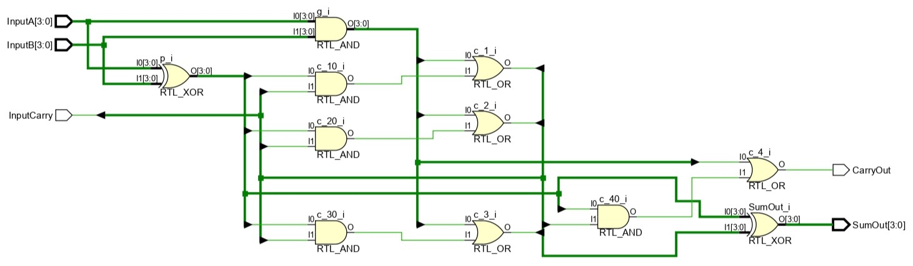
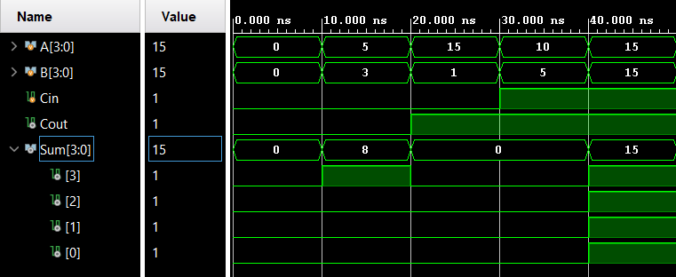

# 
<b>CARRY LOOKAHEAD ADDER (CLA)</b>

## 📌 Overview

The **Carry Lookahead Adder (CLA)** is a high-performance adder designed to overcome the delay limitations of the Ripple Carry Adder (RCA). Instead of waiting for each carry to propagate sequentially, the CLA uses **Generate (G)** and **Propagate (P)** signals to calculate carries in parallel, resulting in significantly faster addition for larger bit-widths.

This project demonstrates a **parameterized N-bit CLA design** using Verilog HDL, allowing scalable implementation. The CLA is a crucial step toward understanding advanced arithmetic circuits used in **ALUs, processors, and VLSI systems**.

---

## 🎯 Objective

* Design and verify an **N-bit Carry Lookahead Adder (default: 4-bit)** in Verilog.
* Demonstrate reduced delay compared to RCA through simulation.
* Document the RTL schematic, truth tables, and waveform outputs for academic and portfolio presentation.

---

## 🧩 RTL Code

List of source files with short descriptions:

* [`src/cla_adder.v`](./src/cla_adder.v): Verilog RTL module for parameterized Carry Lookahead Adder.
* [`tb/cla_adder_tb.v`](./tb/cla_adder_tb.v): Testbench to verify functionality for random and exhaustive test cases.

**Design Equations:**

* **Propagate:** `P[i] = A[i] ⊕ B[i]`
* **Generate:** `G[i] = A[i] · B[i]`
* **Carry:** `C[i+1] = G[i] + (P[i] · C[i])`
* **Sum:** `S[i] = P[i] ⊕ C[i]`

---

## 📊 Example Truth Table (4-bit CLA)

<table border="1" cellpadding="6" cellspacing="0">
  <thead>
    <tr>
      <th>A</th>
      <th>B</th>
      <th>Cin</th>
      <th>SUM</th>
      <th>Cout</th>
    </tr>
  </thead>
  <tbody>
    <tr><td>0000</td><td>0000</td><td>0</td><td>0000</td><td>0</td></tr>
    <tr><td>0101</td><td>0011</td><td>0</td><td>1000</td><td>0</td></tr>
    <tr><td>1111</td><td>0001</td><td>0</td><td>0000</td><td>1</td></tr>
    <tr><td>1010</td><td>0110</td><td>1</td><td>0001</td><td>1</td></tr>
  </tbody>
</table>

  

📄 Full truth table available at: [`sim/cla_truth_table.md`](./sim/cla_truth_table.md)

---

## 🖼️ RTL Schematic

  
📷 File: [`sim/cla_schematic.png`](./sim/cla_schematic.png)  
📄 pdf: [`sim/cla_schematic.pdf`](./sim/cla_schematic.pdf)

---

## 📈 Simulation Waveform

  
🌊 Waveform: [`sim/cla_waveform.png`](./sim/cla_waveform.png)  
📄 Console log: [`sim/tcl_console_output.txt`](./sim/tcl_console_output.txt)

---

## 📑 Conclusion

The **N-bit Carry Lookahead Adder** was successfully implemented and verified. Simulation results confirmed correct logical functionality and demonstrated **faster carry computation** compared to a Ripple Carry Adder. This highlights the importance of CLA in high-speed arithmetic circuits and its relevance in processor design.

📄 Complete report: [`docs/Report.md`](./docs/Report.md)

**Next Steps:**

* Extend design to **16-bit and 32-bit CLAs**.
* Explore **hierarchical CLA structures** (e.g., 4-bit CLA blocks for 16-bit addition).
* Perform **FPGA synthesis and timing analysis** to compare RCA vs CLA performance.

 

 

  <b>Keep Learning</b> 
  <b>Thank You</b>

 