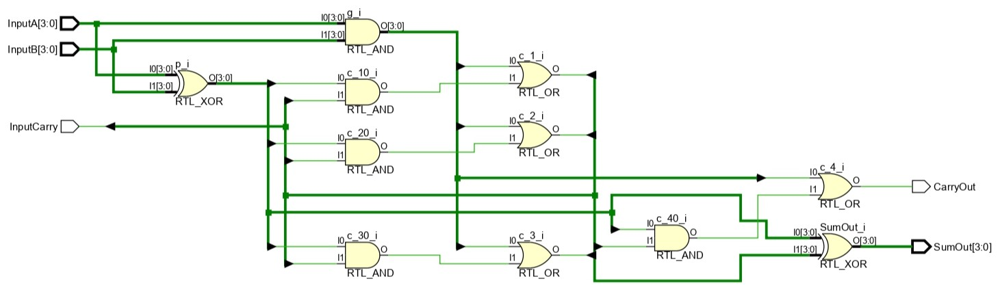

# 
<b>Carry Look-Ahead Adder (CLA) – Project Report

## <b>1. Introduction</b>

  
The Carry Look-Ahead Adder (CLA) is a fast digital adder used in arithmetic circuits to overcome the delay limitations of Ripple Carry Adders (RCA). Instead of waiting for each carry to propagate sequentially, the CLA uses <b>generate</b> and <b>propagate</b> logic to compute carries in parallel, significantly reducing computation delay. This project focuses on designing, simulating, and analyzing a 4-bit CLA using Verilog HDL.  

  

<b>Applications:</b>

<ul>  
  <li>High-speed arithmetic units in CPUs and DSPs</li>  
  <li>Used in FPGA/ASIC-based digital systems</li>  
  <li>Key building block for multipliers and ALUs</li>  
</ul>  

---

## <b>2. Design Methodology</b>

  
The CLA logic is derived from the following equations:  

  

  
<b>Generate: g[i] = A[i] · B[i]</b>   
<b>Propagate: p[i] = A[i] ⊕ B[i]</b>   
<b>Carry: c[i+1] = g[i] + (p[i] · c[i])</b>   
<b>Sum: S[i] = p[i] ⊕ c[i]</b>  

  

  
The design is structured into two Verilog files:  

  

<ul>  
  <li><code>carry_look_ahead_adder.v</code>: RTL module implementing 4-bit CLA</li>  
  <li><code>cla_tb.v</code>: Testbench applying multiple input vectors</li>  
</ul>  

---

## <b>3. Simulation Setup</b>

<b>Tools Used:</b>

<ul>  
  <li>Vivado (for design entry and simulation)</li>  
  <li>GTKWave (for waveform analysis using .vcd)</li>  
</ul>  

<b>Testbench Description:</b>

  
The testbench applies several random and boundary test vectors to verify the CLA functionality. It monitors outputs against expected results of binary addition and logs them in simulation.  

  

---

## <b>4. Results</b>

### ✔️ Truth Table Example (for selected inputs)

  
<table border="1" cellpadding="6" cellspacing="0">  
  <thead>  
    <tr>  
      <th>A</th>  
      <th>B</th>  
      <th>Cin</th>  
      <th>SUM</th>  
      <th>Cout</th>  
    </tr>  
  </thead>  
  <tbody>  
    <tr><td>0101</td><td>0011</td><td>0</td><td>1000</td><td>0</td></tr>  
    <tr><td>1111</td><td>0001</td><td>0</td><td>0000</td><td>1</td></tr>  
    <tr><td>1010</td><td>0101</td><td>1</td><td>1110</td><td>0</td></tr>  
    <tr><td>1111</td><td>1111</td><td>1</td><td>1111</td><td>1</td></tr>  
  </tbody>  
</table>  

  

---

### 🖼️ RTL Schematic

  
  

  

---

### 📈 Simulation Waveform

  
  

  

---

## <b>5. Conclusion</b>

  
The Carry Look-Ahead Adder was successfully designed and simulated using Verilog. Simulation results confirmed that the CLA provides correct addition while reducing propagation delay compared to Ripple Carry Adder. This demonstrates the importance of parallel carry computation in high-speed arithmetic circuits.  

  

<b>Future Work:</b>

<ul>  
  <li>Extend to 8-bit, 16-bit, and 32-bit CLA using hierarchical design</li>  
  <li>Compare delay and resource usage with Ripple Carry Adder</li>  
  <li>Perform synthesis and FPGA implementation for hardware validation</li>  
</ul>  

   

  
   

  
  <b>Keep Learning</b>   
  <b>Thank You</b>  

  
   
