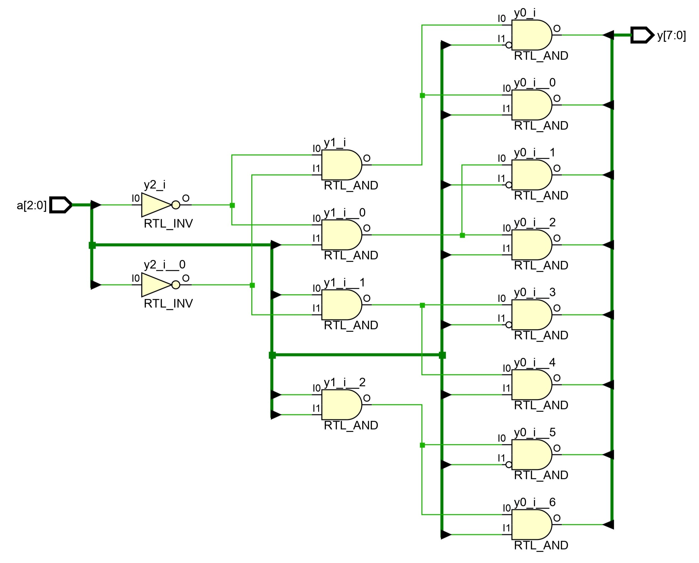
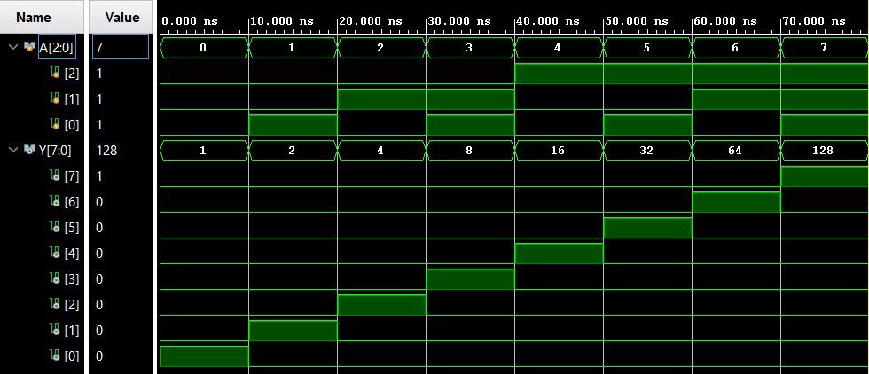

# 
<b>3-to-8 DECODER</b>

## 📌 Overview

A 3-to-8 Decoder is a fundamental combinational circuit that converts a 3-bit binary input into an 8-bit one-hot output. Only one output is active at a time, corresponding to the binary value of the input. Decoders are widely used in **memory address selection, demultiplexing, and control logic**.

This project emphasizes **hierarchical RTL design and functional verification** using Verilog HDL.

## 🎯 Objective

Design and verify a **3-to-8 Decoder** using Verilog. Simulate all input combinations, document the truth table, and capture waveform and schematic outputs for learning and portfolio purposes.

## 🧩 RTL Code

List of source files with short descriptions:

* [`src/decoder_3to8.v`](../decoder_3to8/src/decoder_3to8.v): Verilog RTL module implementing a 3-to-8 Decoder.
* [`tb/decoder_3to8_tb.v`](../decoder_3to8/tb/decoder_3to8_tb.v): Testbench that verifies all possible 3-bit input combinations.

## 📊 Example Truth Table (3-to-8 Decoder)

<table border="1" cellpadding="6" cellspacing="0">
  <thead>
    <tr>
      <th>A2</th>
      <th>A1</th>
      <th>A0</th>
      <th>Y0</th>
      <th>Y1</th>
      <th>Y2</th>
      <th>Y3</th>
      <th>Y4</th>
      <th>Y5</th>
      <th>Y6</th>
      <th>Y7</th>
    </tr>
  </thead>
  <tbody>
    <tr><td>0</td><td>0</td><td>0</td><td>1</td><td>0</td><td>0</td><td>0</td><td>0</td><td>0</td><td>0</td><td>0</td></tr>
    <tr><td>0</td><td>0</td><td>1</td><td>0</td><td>1</td><td>0</td><td>0</td><td>0</td><td>0</td><td>0</td><td>0</td></tr>
    <tr><td>0</td><td>1</td><td>0</td><td>0</td><td>0</td><td>1</td><td>0</td><td>0</td><td>0</td><td>0</td><td>0</td></tr>
    <tr><td>0</td><td>1</td><td>1</td><td>0</td><td>0</td><td>0</td><td>1</td><td>0</td><td>0</td><td>0</td><td>0</td></tr>
    <tr><td>1</td><td>0</td><td>0</td><td>0</td><td>0</td><td>0</td><td>0</td><td>1</td><td>0</td><td>0</td><td>0</td></tr>
    <tr><td>1</td><td>0</td><td>1</td><td>0</td><td>0</td><td>0</td><td>0</td><td>0</td><td>1</td><td>0</td><td>0</td></tr>
    <tr><td>1</td><td>1</td><td>0</td><td>0</td><td>0</td><td>0</td><td>0</td><td>0</td><td>0</td><td>1</td><td>0</td></tr>
    <tr><td>1</td><td>1</td><td>1</td><td>0</td><td>0</td><td>0</td><td>0</td><td>0</td><td>0</td><td>0</td><td>1</td></tr>
  </tbody>
</table>

📄 View full Truth table: [`sim/truth_table.md`](sim/truth_table.md)

## 🖼️ RTL Schematic

<b>3-to-8 Decoder RTL Schematic</b>
 

 

📷 File: [`sim/decoder_3to8_schematic.png`](sim/decoder_3to8_schematic.png)  
📄 pdf: [`sim/decoder_3to8_schematic.pdf`](sim/decoder_3to8_schematic.pdf)

---

## 📈 Simulation Waveform

<b>3-to-8 Decoder Simulation Waveform</b>
 

 

🌊 Waveform: [`sim/decoder_3to8_waveform.png`](sim/decoder_3to8_waveform.vcd)  
📄 Console log: [`sim/tcl_console_output.txt`](sim/tcl_console_output.txt)

---

## 📑 Conclusion

The 3-to-8 Decoder was successfully implemented and verified through simulation. Simulation results confirm correct one-hot output functionality for all input combinations. This project demonstrates **modular, scalable, and reliable RTL design** using Verilog HDL.

📄 Complete report: [`docs/Report.md`](docs/Report.md)

**Next Steps:**

* Extend design to 4-to-16 or 5-to-32 Decoders.
* Integrate Decoder modules in memory selection or control logic.
* Perform FPGA synthesis, timing, and area analysis.

 

 

  <b>Keep Learning</b> 
  <b>Thank You</b>

 
