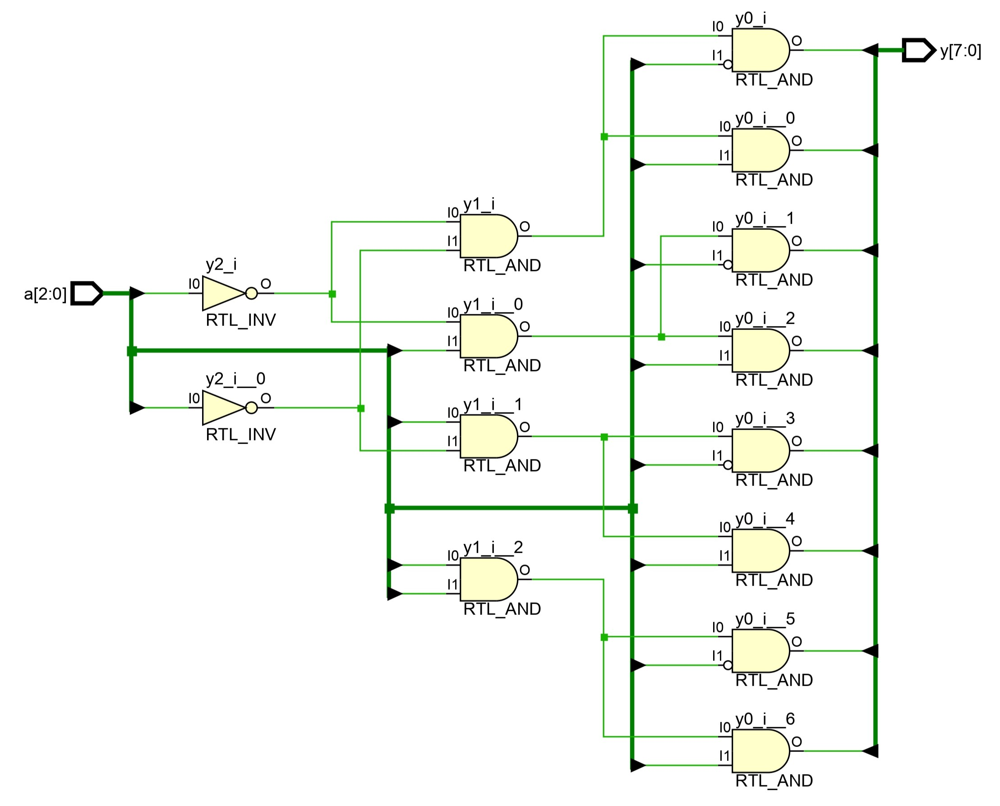
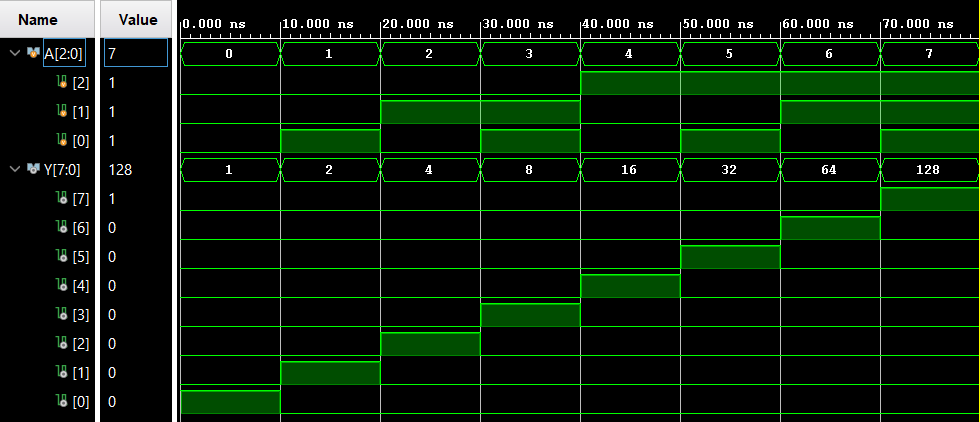

# 
<b>3-to-8 Decoder – Project Report</b>

## <b>1. Introduction</b>

A 3-to-8 Decoder is a combinational digital circuit that converts a 3-bit binary input into an 8-bit one-hot output. Each output line corresponds to one of the 8 possible input combinations, and only one output is active at a time. Decoders are widely used in memory address decoding, demultiplexing, and digital system control.

<b>Applications:</b>

<ul>
  <li>Memory address decoding in RAM/ROM</li>
  <li>Demultiplexing data lines to multiple destinations</li>
  <li>Control logic in digital systems and microprocessors</li>
</ul>

---

## <b>2. Design Methodology</b>

The 3-to-8 Decoder generates 8 outputs (Y0–Y7) from 3 input lines (A2, A1, A0). Only the output corresponding to the binary input value is set to 1, and all others remain 0. The Boolean equations for the outputs are:

<b>Y0 = A2'·A1'·A0' 
Y1 = A2'·A1'·A0 
Y2 = A2'·A1·A0' 
Y3 = A2'·A1·A0 
Y4 = A2·A1'·A0' 
Y5 = A2·A1'·A0 
Y6 = A2·A1·A0' 
Y7 = A2·A1·A0</b>

For this project:

<ul>
  <li><code>decoder_3to8.v</code>: RTL module implementing the 3-to-8 Decoder</li>
  <li><code>decoder_3to8_tb.v</code>: Testbench for exhaustive verification</li>
</ul>

---

## <b>3. Simulation Setup</b>

<b>Tools Used:</b>

<ul>
  <li>Vivado (for RTL design and simulation)</li>
  <li>GTKWave (optional, for waveform analysis via .vcd files)</li>
</ul>

<b>Testbench Description:</b>

The testbench applies all 8 possible input combinations of the three input lines (A2–A0). The outputs (Y0–Y7) are compared against expected one-hot values. Simulation waveforms and logs are captured for documentation and verification purposes.

---

## <b>4. Results</b>

### ✔️ Example Truth Table (3-to-8 Decoder)

<table border="1" cellpadding="6" cellspacing="0">
  <thead>
    <tr>
      <th>A2</th>
      <th>A1</th>
      <th>A0</th>
      <th>Y0</th>
      <th>Y1</th>
      <th>Y2</th>
      <th>Y3</th>
      <th>Y4</th>
      <th>Y5</th>
      <th>Y6</th>
      <th>Y7</th>
    </tr>
  </thead>
  <tbody>
    <tr><td>0</td><td>0</td><td>0</td><td>1</td><td>0</td><td>0</td><td>0</td><td>0</td><td>0</td><td>0</td><td>0</td></tr>
    <tr><td>0</td><td>0</td><td>1</td><td>0</td><td>1</td><td>0</td><td>0</td><td>0</td><td>0</td><td>0</td><td>0</td></tr>
    <tr><td>0</td><td>1</td><td>0</td><td>0</td><td>0</td><td>1</td><td>0</td><td>0</td><td>0</td><td>0</td><td>0</td></tr>
    <tr><td>0</td><td>1</td><td>1</td><td>0</td><td>0</td><td>0</td><td>1</td><td>0</td><td>0</td><td>0</td><td>0</td></tr>
    <tr><td>1</td><td>0</td><td>0</td><td>0</td><td>0</td><td>0</td><td>0</td><td>1</td><td>0</td><td>0</td><td>0</td></tr>
    <tr><td>1</td><td>0</td><td>1</td><td>0</td><td>0</td><td>0</td><td>0</td><td>0</td><td>1</td><td>0</td><td>0</td></tr>
    <tr><td>1</td><td>1</td><td>0</td><td>0</td><td>0</td><td>0</td><td>0</td><td>0</td><td>0</td><td>1</td><td>0</td></tr>
    <tr><td>1</td><td>1</td><td>1</td><td>0</td><td>0</td><td>0</td><td>0</td><td>0</td><td>0</td><td>0</td><td>1</td></tr>
  </tbody>
</table>

---

### 🖼️ RTL Schematic

<b>3-to-8 Decoder RTL Schematic</b>  

---

### 📈 Simulation Waveform

<b>3-to-8 Decoder Simulation Waveform</b>  

---

## <b>5. Conclusion</b>

The 3-to-8 Decoder was successfully implemented and verified using Verilog. Simulation outputs matched the expected one-hot values for all input combinations, demonstrating correct functionality. The design can be scaled to N-to-2^N decoders for larger digital systems.

<b>Future Work:</b>

<ul>
  <li>Implement a 4-to-16 or 5-to-32 Decoder</li>
  <li>Integrate the decoder in memory address selection or control logic</li>
  <li>Perform FPGA synthesis and timing analysis</li>
</ul>

 

 

  <b>Keep Learning</b> 
  <b>Thank You</b>

 
