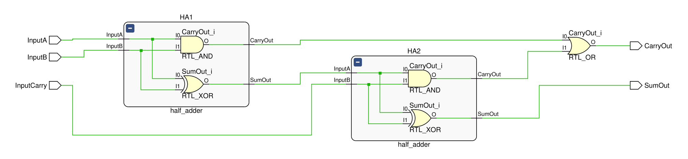

# 
<b>FULL ADDER</b>

## 📌 Overview

The Full Adder is a combinational logic circuit that extends the Half Adder by including a third input, **Cin** (carry-in). It produces two outputs: **SUM** and **CARRY**. The Full Adder can be efficiently implemented using **two Half Adders and an OR gate**, demonstrating hierarchical design and module reusability.

This project reuses the [`half_adder.v`](../half_adder/src/half_adder.v) RTL design from the neighboring `half_adder` project, highlighting modular design practices and professional project structuring.

## 🎯 Objective

Design and verify a Full Adder using Verilog by reusing the Half Adder module. Simulate all input combinations, document the truth table, and present waveform and schematic outputs for portfolio and recruiter visibility.

## 🧩 RTL Code

List of source files with short descriptions:

* [`../half_adder/src/half_adder.v`](../half_adder/src/half_adder.v): Reused Half Adder RTL module.
* [`src/full_adder.v`](../full_adder/src/full_adder.v): Verilog RTL module implementing Full Adder using two Half Adders and an OR gate.
* [`tb/full_adder_tb.v`](../full_adder/tb/full_adder_tb.v): Testbench that exhaustively verifies all input combinations (000 → 111).

## 📊 Truth Table

<table border="1" cellpadding="6" cellspacing="0">
  <thead>
    <tr>
      <th>A</th>
      <th>B</th>
      <th>Cin</th>
      <th>SUM</th>
      <th>CARRY</th>
    </tr>
  </thead>
  <tbody>
    <tr><td>0</td><td>0</td><td>0</td><td>0</td><td>0</td></tr>
    <tr><td>0</td><td>0</td><td>1</td><td>1</td><td>0</td></tr>
    <tr><td>0</td><td>1</td><td>0</td><td>1</td><td>0</td></tr>
    <tr><td>0</td><td>1</td><td>1</td><td>0</td><td>1</td></tr>
    <tr><td>1</td><td>0</td><td>0</td><td>1</td><td>0</td></tr>
    <tr><td>1</td><td>0</td><td>1</td><td>0</td><td>1</td></tr>
    <tr><td>1</td><td>1</td><td>0</td><td>0</td><td>1</td></tr>
    <tr><td>1</td><td>1</td><td>1</td><td>1</td><td>1</td></tr>
  </tbody>
</table>

📄 View full Truth table: [`sim/full_adder_truth_table.md`](sim/full_adder_truth_table.md)

## 🖼️ RTL Schematic

  
📷 File: [`sim/full_adder_schematic.png`](sim/full_adder_schematic.png)  
📄 pdf: [`sim/full_adder_schematic.pdf`](sim/full_adder_schematic.pdf)

---

## 📈 Simulation Waveform

  
📷 File: [`sim/full_adder_waveform.png`](sim/full_adder_waveform.png)  
🌊 Waveform: [`sim/full_adder_waveform.vcd`](sim/full_adder_waveform.vcd)  
📄 Console log: [`sim/tcl_console_output.txt`](sim/tcl_console_output.txt)

---

## 📑 Conclusion

The Full Adder was successfully implemented and verified through simulation. By reusing the [`half_adder.v`](../half_adder/src/half_adder.v) module, the design demonstrates hierarchical modularity and efficient project structuring. Simulation results confirm correct functionality across all input cases.

📄 Complete report: [`docs/Report.md`](docs/Report.md)

**Next Steps:**

* Extend the design to a 4-bit Ripple Carry Adder using multiple Full Adders.
* Explore faster adders such as Carry Lookahead Adder.
* Document synthesis results and timing analysis for FPGA implementation.

 

 

  <b>Keep Learning</b> 
  <b>Thank You</b>

 
