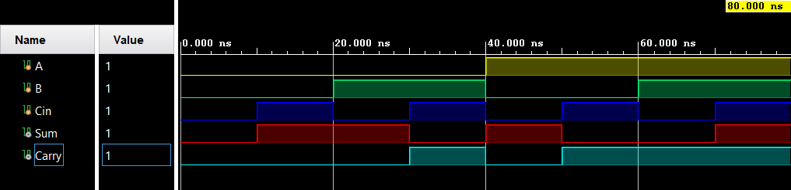

# 
<b>Full Adder – Project Report

## <b>1. Introduction</b>

The Full Adder is an essential digital circuit used to perform binary addition of three single-bit inputs: two operands and a carry-in. It produces two outputs: <b>SUM</b> and <b>CARRY</b>. This project aims to design and verify a Full Adder using Verilog HDL, simulate its behavior, and document the results for academic and professional presentation.

<b>Applications:</b>

<ul>
  <li>Construction of multi-bit adders (Ripple Carry, Carry Lookahead)</li>
  <li>Arithmetic Logic Units (ALUs)</li>
  <li>Integral part of processors and digital systems</li>
</ul>

---

## <b>2. Design Methodology</b>

The Full Adder logic is based on the following Boolean equations:

<b>SUM = A ⊕ B ⊕ Cin</b> 
<b>CARRY = A·B + (A ⊕ B)·Cin</b>

These equations are implemented in Verilog using two Half Adders and an OR gate. The design consists of:

<ul>
  <li><code>half_adder.v</code>: RTL module for Half Adder</li>
  <li><code>full_adder.v</code>: RTL module for Full Adder built using Half Adders</li>
  <li><code>full_adder_tb.v</code>: Testbench to verify all input combinations</li>
</ul>

---

## <b>3. Simulation Setup</b>

<b>Tools Used:</b>

<ul>
  <li>Vivado (for RTL design and simulation)</li>
  <li>GTKWave (optional, for waveform viewing via .vcd)</li>
</ul>

<b>Testbench Description:</b>

The testbench applies all eight possible input combinations of A, B, and Cin, and monitors the outputs. Simulation logs and waveform screenshots are saved for documentation.

---

## <b>4. Results</b>

### ✔️ Truth Table

<table border="1" cellpadding="6" cellspacing="0">
  <thead>
    <tr>
      <th>A</th>
      <th>B</th>
      <th>Cin</th>
      <th>SUM</th>
      <th>CARRY</th>
    </tr>
  </thead>
  <tbody>
    <tr><td>0</td><td>0</td><td>0</td><td>0</td><td>0</td></tr>
    <tr><td>0</td><td>0</td><td>1</td><td>1</td><td>0</td></tr>
    <tr><td>0</td><td>1</td><td>0</td><td>1</td><td>0</td></tr>
    <tr><td>0</td><td>1</td><td>1</td><td>0</td><td>1</td></tr>
    <tr><td>1</td><td>0</td><td>0</td><td>1</td><td>0</td></tr>
    <tr><td>1</td><td>0</td><td>1</td><td>0</td><td>1</td></tr>
    <tr><td>1</td><td>1</td><td>0</td><td>0</td><td>1</td></tr>
    <tr><td>1</td><td>1</td><td>1</td><td>1</td><td>1</td></tr>
  </tbody>
</table>

---

### 🖼️ RTL Schematic

---

### 📈 Simulation Waveform

---

## <b>5. Conclusion</b>

The Full Adder was successfully designed and verified using Verilog. Simulation results matched the expected truth table, confirming correct logical behavior. This project demonstrates hierarchical design by reusing Half Adder modules and serves as a foundation for building more complex arithmetic circuits.

<b>Future Work:</b>

<ul>
  <li>Extend to 4-bit Ripple Carry Adder</li>
  <li>Explore Carry Lookahead Adder for speed improvement</li>
  <li>Perform synthesis and timing analysis for FPGA implementation</li>
</ul>

 
 

keep Learning

<b>Thank you</b>

