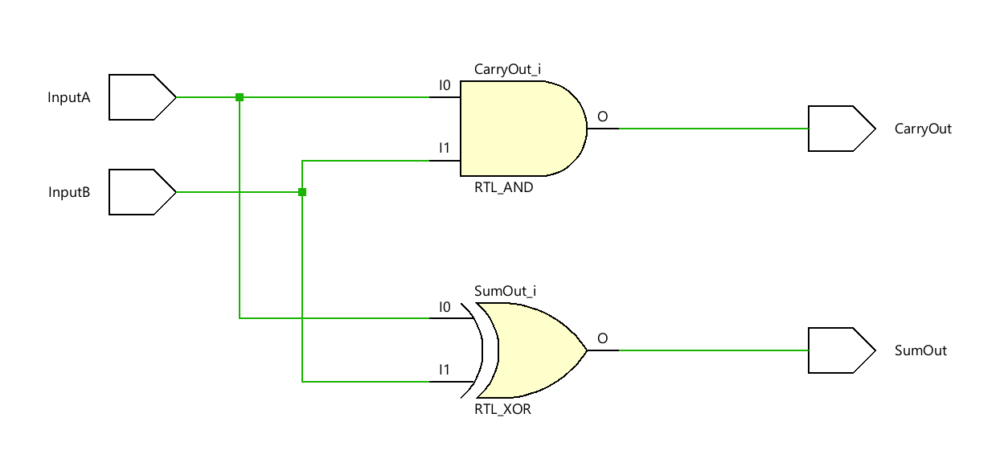

# 
<b>HALF ADDER</b>

## 📌 Overview  
Half Adder is a basic combinational logic circuit that performs the addition of two single-bit binary numbers. It produces two outputs: **SUM** and **CARRY**, based on the XOR and AND operations respectively.

## 🎯 Objective  
Design and verify a Half Adder using Verilog. The goal is to simulate all input combinations, document the truth table, and present waveform and schematic outputs for portfolio and recruiter visibility.

## 🧩 RTL Code  
List of source files with short descriptions:

- [`src/half_adder.v`](../src/half_adder.v): Verilog RTL module implementing Half Adder logic using XOR and AND gates.  
- [`tb/half_adder_tb.v`](../tb/half_adder_tb.v): Testbench that exhaustively verifies all input combinations (00, 01, 10, 11).

## 📊 Truth Table  

<table border="1" cellpadding="6" cellspacing="0">
  <thead>
    <tr>
      <th>A</th>
      <th>B</th>
      <th>SUM</th>
      <th>CARRY</th>
    </tr>
  </thead>
  <tbody>
    <tr><td>0</td><td>0</td><td>0</td><td>0</td></tr>
    <tr><td>0</td><td>1</td><td>1</td><td>0</td></tr>
    <tr><td>1</td><td>0</td><td>1</td><td>0</td></tr>
    <tr><td>1</td><td>1</td><td>0</td><td>1</td></tr>
  </tbody>
</table>

📄 View full Markdown version: [`sim/half_adder_truth_table.md`](sim/half_adder_truth_table.md)

## 🖼️ RTL Schematic  
  
📷 File: [`sim/half_adder_schematic.png`](sim/half_adder_schematic.png)

---

## 📈 Simulation Waveform  
  
📷 File: [`sim/half_adder_waveform.png`](sim/half_adder_waveform.png)  
📄 Console log: [`sim/tcl_console_output.txt`](sim/tcl_console_output.txt)

---

## 📑 Conclusion  
The Half Adder was successfully implemented and verified through simulation. The waveform confirms expected behavior for all input combinations. This module serves as a foundational building block for more complex arithmetic circuits.

**Next Steps:**
- Extend to Full Adder using two Half Adders and an OR gate.
- Build a 4-bit ripple carry adder.
- Document synthesis results and timing analysis for hardware implementation.

 

  <b>Keep Learning</b> 
  <b>Thank You</b>

