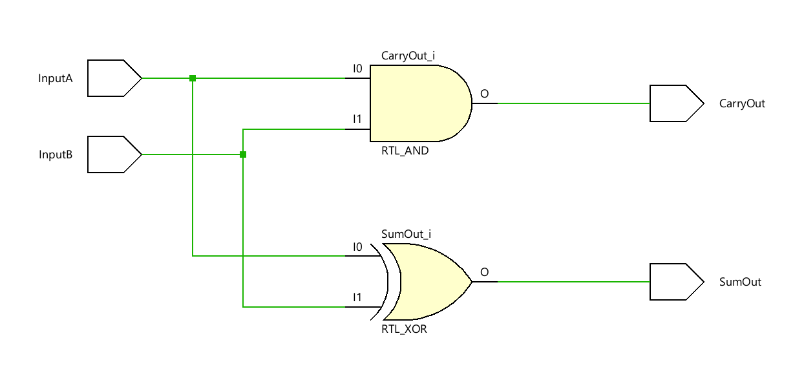
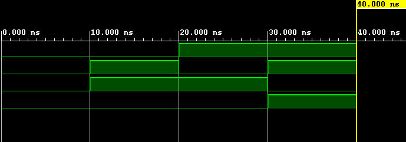

# 
<b>Half Adder – Project Report

## <b>1. Introduction</b>

The Half Adder is a fundamental digital circuit used to perform binary addition of two single-bit inputs. It produces two outputs: <b>SUM</b> and <b>CARRY</b>. This project aims to design and verify a Half Adder using Verilog HDL, simulate its behavior, and document the results for academic and professional presentation.

<b>Applications:</b>
<ul>
  <li>Building blocks for Full Adders and ALUs</li>
  <li>Used in digital calculators and embedded processors</li>
  <li>Essential for understanding combinational logic design</li>
</ul>

---

## <b>2. Design Methodology</b>

The Half Adder logic is based on the following Boolean equations:

<b>SUM = A ⊕ B</b> 
<b>CARRY = A · B</b>

These equations are implemented in Verilog using bitwise operators. The design consists of:

<ul>
  <li><code>half_adder.v</code>: RTL module implementing the logic</li>
  <li><code>half_adder_tb.v</code>: Testbench to verify all input combinations</li>
</ul>

---

## <b>3. Simulation Setup</b>

<b>Tools Used:</b>
<ul>
  <li>Vivado (for RTL design and simulation)</li>
  <li>GTKWave (optional, for waveform viewing via .vcd)</li>
</ul>

<b>Testbench Description:</b>

The testbench applies all four possible input combinations (00, 01, 10, 11) and monitors the outputs. Simulation logs and waveform screenshots are saved for documentation.

---

## <b>4. Results</b>

### ✔️ Truth Table

<table border="1" cellpadding="6" cellspacing="0">
  <thead>
    <tr>
      <th>A</th>
      <th>B</th>
      <th>SUM</th>
      <th>CARRY</th>
    </tr>
  </thead>
  <tbody>
    <tr><td>0</td><td>0</td><td>0</td><td>0</td></tr>
    <tr><td>0</td><td>1</td><td>1</td><td>0</td></tr>
    <tr><td>1</td><td>0</td><td>1</td><td>0</td></tr>
    <tr><td>1</td><td>1</td><td>0</td><td>1</td></tr>
  </tbody>
</table>

---

### 🖼️ RTL Schematic

---

### 📈 Simulation Waveform

---

## <b>5. Conclusion</b>

The Half Adder was successfully designed and verified using Verilog. Simulation results matched the expected truth table, confirming correct logical behavior. This project reinforces understanding of basic combinational logic and serves as a stepping stone toward more complex arithmetic circuits.

<b>Future Work:</b>
<ul>
  <li>Extend to Full Adder using two Half Adders and an OR gate</li>
  <li>Build multi-bit ripple carry adders</li>
  <li>Perform synthesis and timing analysis for FPGA implementation</li>
</ul>

 

  <b>Keep Learning</b> 
  <b>Thank You</b>

 
