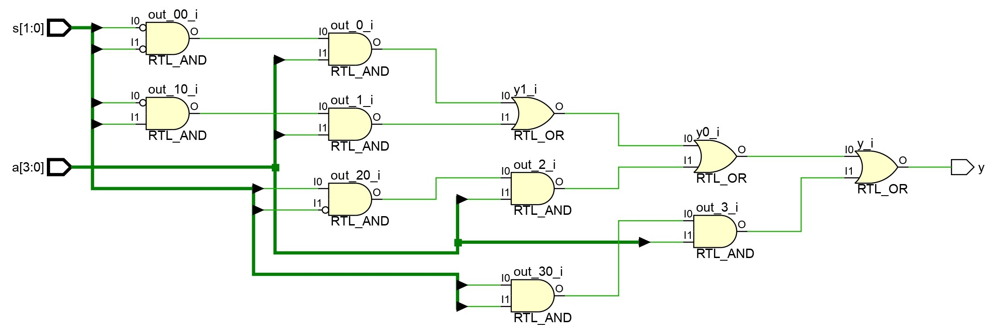

# 
<b>4-to-1 MULTIPLEXER (MUX)</b>

## 📌 Overview

A 4-to-1 Multiplexer (MUX) is a fundamental combinational circuit that selects one of four input lines (D0–D3) and routes it to a single output (Y) based on the values of two select lines (S1, S0). It is widely used in digital systems for **data routing, logic implementation, and resource sharing**.

This project highlights **hierarchical design principles and module verification** using Verilog HDL.

## 🎯 Objective

Design and verify a **4-to-1 Multiplexer** using Verilog. Simulate all input combinations of data lines and select lines, document truth table entries, and present waveform and schematic outputs for learning and portfolio purposes.

## 🧩 RTL Code

List of source files with short descriptions:

* [`src/mux_4to1.v`](../mux_4to1/src/mux_4to1.v): Verilog RTL module implementing a 4-to-1 Multiplexer.
* [`tb/mux_4to1_tb.v`](../mux_4to1/tb/mux_4to1_tb.v): Testbench that verifies all possible input and select line combinations.

## 📊 Example Truth Table (4-to-1 MUX)

<table border="1" cellpadding="6" cellspacing="0">
  <thead>
    <tr>
      <th>S1</th>
      <th>S0</th>
      <th>D0</th>
      <th>D1</th>
      <th>D2</th>
      <th>D3</th>
      <th>Y</th>
    </tr>
  </thead>
  <tbody>
    <tr><td>0</td><td>0</td><td>0</td><td>0</td><td>0</td><td>0</td><td>0</td></tr>
    <tr><td>0</td><td>1</td><td>0</td><td>1</td><td>0</td><td>0</td><td>1</td></tr>
    <tr><td>1</td><td>0</td><td>1</td><td>0</td><td>1</td><td>0</td><td>1</td></tr>
    <tr><td>1</td><td>1</td><td>0</td><td>1</td><td>0</td><td>1</td><td>1</td></tr>
  </tbody>
</table>

📄 View full Truth table: [`sim/truth_table.md`](sim/truth_table.md)

## 🖼️ RTL Schematic

<b>4-to-1 MUX RTL Schematic</b>
 

 

📷 File: [`sim/mux_4to1_schematic.png`](sim/mux_4to1_schematic.png)  
📄 pdf: [`sim/mux_4to1_schematic.pdf`](sim/mux_4to1_schematic.pdf)

---

## 📈 Simulation Waveform

<b>4-to-1 MUX Simulation Waveform</b>
 

 

🌊 Waveform: [`sim/waveform.png`](sim/mux_4to1_waveform.png)  
📄 Console log: [`sim/tcl_console_output.txt`](sim/tcl_console_output.txt)

---

## 📑 Conclusion

The 4-to-1 Multiplexer was successfully implemented and verified through simulation. Simulation results confirm correct functionality across all input and select line combinations. This project demonstrates **modular and scalable design principles** using Verilog HDL.

📄 Complete report: [`docs/Report.md`](docs/Report.md)

**Next Steps:**

* Extend design to 8-to-1 or 16-to-1 Multiplexers.
* Integrate MUX modules in ALUs or digital routing blocks.
* Perform FPGA synthesis and timing analysis.

 

 

  <b>Keep Learning</b> 
  <b>Thank You</b>

 
