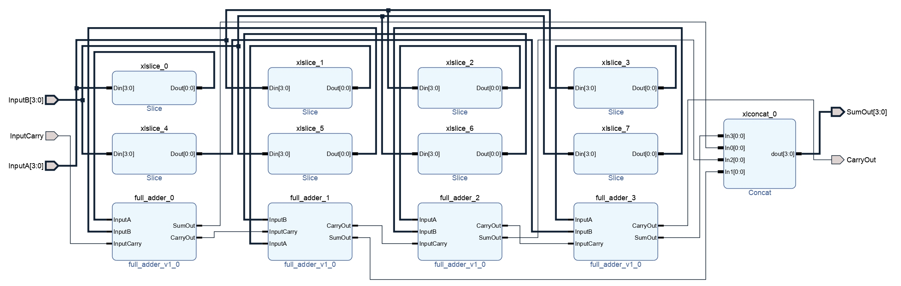
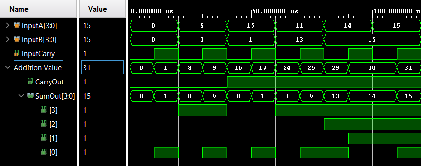

# 
<b>RIPPLE CARRY ADDER</b>

## 📌 Overview

The Ripple Carry Adder (RCA) is a fundamental combinational circuit that performs binary addition of multi-bit numbers. It is built by cascading multiple **Full Adders**, where each carry-out feeds the carry-in of the next stage. Although simple, the RCA suffers from propagation delay since each bit must wait for the previous carry to propagate.

This project reuses the [`full_adder.v`](../full_adder/src/full_adder.v) RTL design from the neighboring `full_adder` project, highlighting **hierarchical design and module reusability**.

## 🎯 Objective

Design and verify a **4-bit Ripple Carry Adder** using Verilog by instantiating four Full Adder modules. Simulate all input combinations, document truth table entries, and present waveform and schematic outputs for portfolio and recruiter visibility.

## 🧩 RTL Code

List of source files with short descriptions:

* [`../full_adder/src/full_adder.v`](../full_adder/src/full_adder.v): Reused 1-bit Full Adder RTL module.
* [`src/ripple_carry_adder.v`](../ripple_carry_adder/src/ripple_carry_adder.v): Verilog RTL module implementing a 4-bit Ripple Carry Adder using four Full Adders.
* [`tb/ripple_carry_adder_tb.v`](../ripple_carry_adder/tb/ripple_carry_adder_tb.v): Testbench that verifies all possible input combinations of 4-bit operands A, B, and Cin.

## 📊 Example Truth Table (4-bit RCA)

<table border="1" cellpadding="6" cellspacing="0">
  <thead>
    <tr>
      <th>A</th>
      <th>B</th>
      <th>Cin</th>
      <th>SUM</th>
      <th>Cout</th>
    </tr>
  </thead>
  <tbody>
    <tr><td>0000</td><td>0000</td><td>0</td><td>0000</td><td>0</td></tr>
    <tr><td>0001</td><td>0001</td><td>0</td><td>0010</td><td>0</td></tr>
    <tr><td>0101</td><td>0011</td><td>0</td><td>1000</td><td>0</td></tr>
    <tr><td>1111</td><td>0001</td><td>0</td><td>0000</td><td>1</td></tr>
    <tr><td>1111</td><td>1111</td><td>1</td><td>1111</td><td>1</td></tr>
  </tbody>
</table>

📄 View full Truth table: [`sim/rca_truth_table.md`](sim/rca_truth_table.md)

## 🖼️ RTL Schematic

  
📷 File: [`sim/rca_schematic.png`](sim/rca_schematic.png)  
📄 pdf: [`sim/rca_schematic.pdf`](sim/rca_schematic.pdf)

---

## 📈 Simulation Waveform

  
📷 File: [`sim/rca_waveform.png`](sim/rca_waveform.png)  
🌊 Waveform: [`sim/rca_waveform.vcd`](sim/rca_waveform.vcd)  
📄 Console log: [`sim/tcl_console_output.txt`](sim/tcl_console_output.txt)

---

## 📑 Conclusion

The 4-bit Ripple Carry Adder was successfully implemented and verified through simulation. By reusing the [`full_adder.v`](../full_adder/src/full_adder.v) module, the design demonstrates **hierarchical modularity** and **scalable design principles**. Simulation results confirm correct functionality across all test cases.

📄 Complete report: [`docs/Report.md`](docs/Report.md)

**Next Steps:**

* Extend design to 8-bit and 16-bit Ripple Carry Adders.
* Explore faster adders such as Carry Lookahead Adder.
* Document synthesis, timing, and FPGA implementation results.

 

 

  <b>Keep Learning</b> 
  <b>Thank You</b>

 

