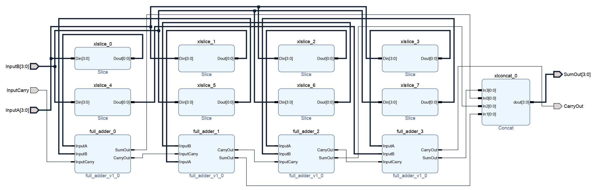
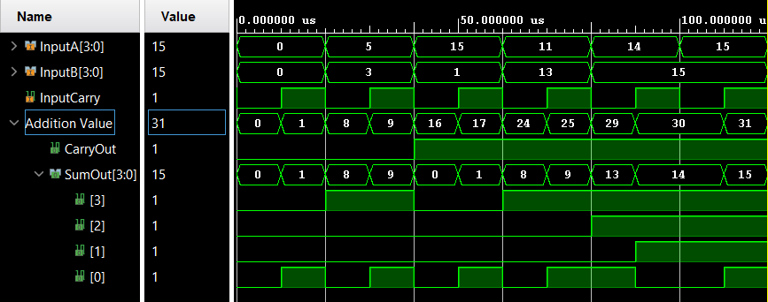

# 
<b>Ripple Carry Adder – Project Report</b>

## <b>1. Introduction</b>

The Ripple Carry Adder (RCA) is a fundamental digital circuit used to perform binary addition of multi-bit numbers. It is constructed by cascading multiple Full Adders, where the carry output of one stage is connected to the carry input of the next stage. Although it is simple in design, the RCA suffers from carry propagation delay, making it slower for large bit-widths. This project focuses on designing a 4-bit Ripple Carry Adder using Verilog HDL, simulating its behavior, and verifying results.

<b>Applications:</b>

<ul>
  <li>Binary addition in Arithmetic Logic Units (ALUs)</li>
  <li>Basic building block for more advanced adders (Carry Lookahead, Carry Select)</li>
  <li>Used in processors, DSPs, and digital systems</li>
</ul>

---

## <b>2. Design Methodology</b>

The Ripple Carry Adder is designed by chaining <b>n Full Adders</b> together. The logic equations for each Full Adder stage are:

---

### 🧮 4-bit RCA Bitwise Representation

 <table border="1" cellpadding="6" cellspacing="0"> <thead> <tr> <th></th> <th>c2</th> <th>c1</th> <th>c0</th> </tr> </thead> <tbody> <tr> <td><b>A</b></td> <td>a3</td> <td>a2</td> <td>a1</td> <td>a0</td> </tr> <tr> <td><b>B</b></td> <td>b3</td> <td>b2</td> <td>b1</td> <td>b0</td> </tr> <tr> <td colspan="5">
</td> </tr> <tr> <td><b>SUM</b></td> <td>s3</td> <td>s2</td> <td>s1</td> <td>s0</td> </tr> <tr> <td><b>Carry-out</b></td> <td colspan="4" align="center">Cout</td> </tr> </tbody> </table> 

<b>SUMi = Ai ⊕ Bi ⊕ Cin</b> 
<b>CARRYi+1 = Ai·Bi + (Ai ⊕ Bi)·Cin</b>

For a 4-bit RCA:

<ul>
  <li><code>full_adder.v</code>: RTL module for 1-bit Full Adder</li>
  <li><code>ripple_carry_adder.v</code>: RTL module for 4-bit RCA using Full Adders</li>
  <li><code>ripple_carry_adder_tb.v</code>: Testbench for exhaustive verification</li>
</ul>

---

## <b>3. Simulation Setup</b>

<b>Tools Used:</b>

<ul>
  <li>Vivado (for RTL design and simulation)</li>
  <li>GTKWave (optional, for waveform analysis via .vcd files)</li>
</ul>

<b>Testbench Description:</b>

The testbench applies all 16×16 input combinations of two 4-bit operands (A and B) along with carry-in. Simulation results (SUM and Carry-out) are compared against expected values. Waveform and logs are saved for verification.

---

## <b>4. Results</b>

### ✔️ Example Truth Table (4-bit RCA)

<table border="1" cellpadding="6" cellspacing="0">
  <thead>
    <tr>
      <th>A</th>
      <th>B</th>
      <th>Cin</th>
      <th>SUM</th>
      <th>Cout</th>
    </tr>
  </thead>
  <tbody>
    <tr><td>0000</td><td>0000</td><td>0</td><td>0000</td><td>0</td></tr>
    <tr><td>0001</td><td>0001</td><td>0</td><td>0010</td><td>0</td></tr>
    <tr><td>0101</td><td>0011</td><td>0</td><td>1000</td><td>0</td></tr>
    <tr><td>1111</td><td>0001</td><td>0</td><td>0000</td><td>1</td></tr>
    <tr><td>1111</td><td>1111</td><td>1</td><td>1111</td><td>1</td></tr>
  </tbody>
</table>

---
### 🧮 Worked Example (A=1011, B=0110, Cin=1)

<table border="1" cellpadding="6" cellspacing="0">
  <thead>
    <tr>
      <th></th>
      <th>Bit 3</th>
      <th>Bit 2</th>
      <th>Bit 1</th>
      <th>Bit 0</th>
    </tr>
  </thead>
  <tbody>
    <tr>
      <td><b>Carry-in →</b></td>
      <td>c2</td>
      <td>c1</td>
      <td>c0</td>
      <td>Cin</td>
    </tr>
    <tr>
      <td><b>A</b></td>
      <td>a3=1</td>
      <td>a2=0</td>
      <td>a1=1</td>
      <td>a0=1</td>
    </tr>
    <tr>
      <td><b>B</b></td>
      <td>b3=0</td>
      <td>b2=1</td>
      <td>b1=1</td>
      <td>b0=0</td>
    </tr>
    <tr>
      <td colspan="5">
</td>
    </tr>
    <tr>
      <td><b>SUM</b></td>
      <td>s3=0</td>
      <td>s2=0</td>
      <td>s1=1</td>
      <td>s0=0</td>
    </tr>
    <tr>
      <td><b>Final Carry-out</b></td>
      <td colspan="4" align="center">Cout = 1</td>
    </tr>
  </tbody>
</table>

**Bitwise math (LSB→MSB):**
- Bit0: 1 ⊕ 0 ⊕ 1 → s₀=0, c₀=1  
- Bit1: 1 ⊕ 1 ⊕ c₀(=1) → s₁=1, c₁=1  
- Bit2: 0 ⊕ 1 ⊕ c₁(=1) → s₂=0, c₂=1  
- Bit3: 1 ⊕ 0 ⊕ c₂(=1) → s₃=0, Cout=1

**Result:**  
1011₂ + 0110₂ + 1 = **1·0010₂** → **Cout=1, SUM=0010**.

---

### 🖼️ RTL Schematic

---

### 📈 Simulation Waveform

---

## <b>5. Conclusion</b>

The 4-bit Ripple Carry Adder was successfully designed and verified using Verilog. The simulation outputs matched the expected results, demonstrating correct functionality. Although simple and easy to implement, the RCA suffers from carry propagation delay, which limits its performance for larger bit-widths.

<b>Future Work:</b>

<ul>
  <li>Extend design to 8-bit and 16-bit adders</li>
  <li>Implement Carry Lookahead Adder (CLA) for improved speed</li>
  <li>Perform synthesis, place and route, and FPGA implementation</li>
</ul>

 

 

  <b>Keep Learning</b> 
  <b>Thank You</b>

 
